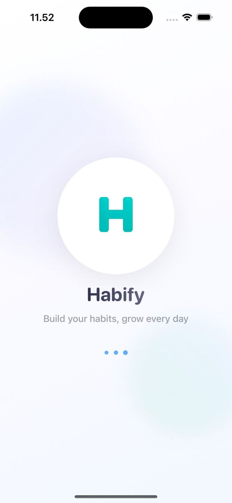
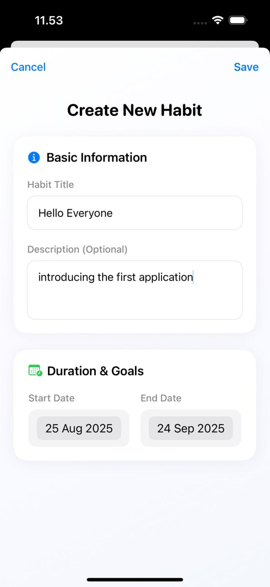
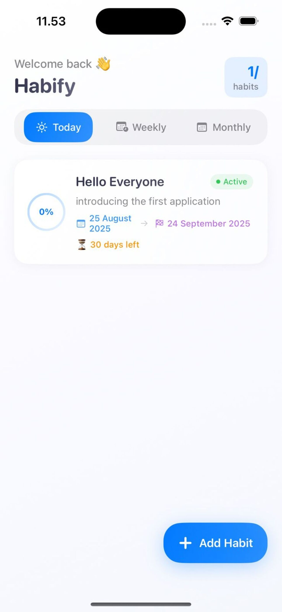

# 📱 Habify Track

**Habify Track** is an iOS app that helps you build and maintain positive habits with a simple yet effective approach.  
Now available on the [App Store](https://apps.apple.com/app/habify-track/id6751479845).

---

## ✨ Features
- ✅ **Habit CRUD** – Create, edit, delete, and manage your habits easily.  
- 🗓 **Daily, Weekly, Monthly Tracking** – Monitor your progress across different time periods.  
- 🔔 **Reminders** – Scheduled notifications to keep you consistent.  
- 🌙 **Dark Mode Support** – Light and dark themes supported.  
- 🎨 **Modern UI** – Clean and minimal SwiftUI-based design.  
- 💾 **Offline First** – Data stored locally using SQLite, no internet required.  

---

## 🛠 Tech Stack
- **Swift** & **SwiftUI**  
- **SQLite** (`sqlite3`) for local persistence  
- **UserNotifications** for reminders  

---

## 📷 Screenshots

  
  
  

---